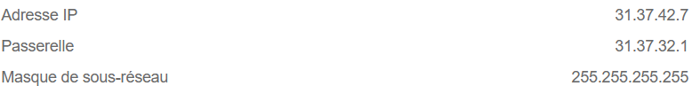
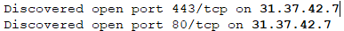
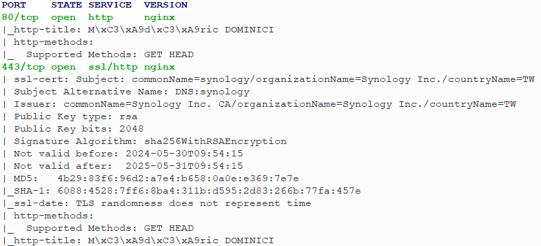
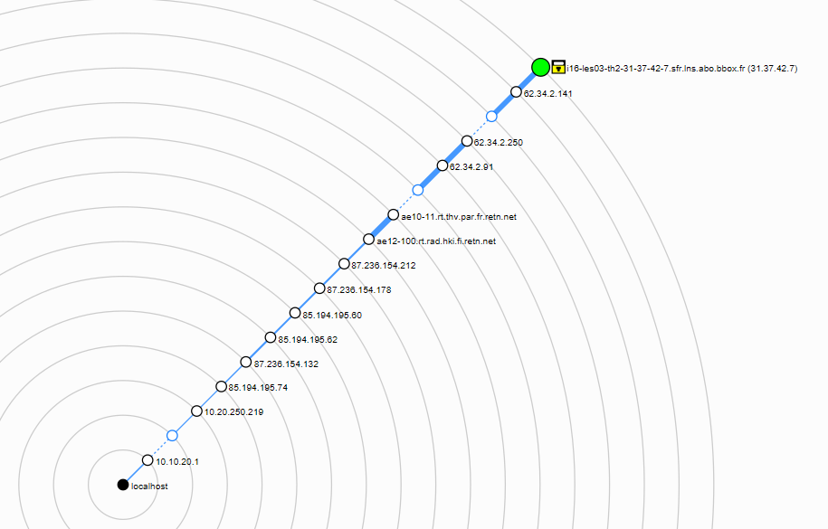
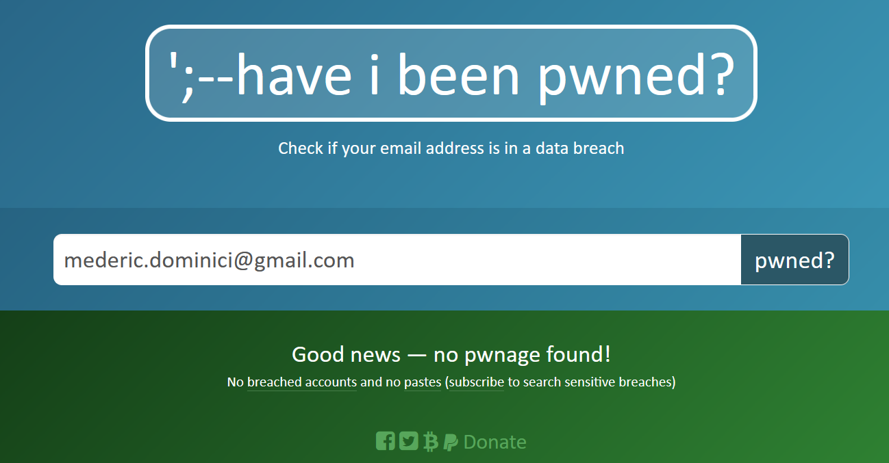

# Task 1
These are all the actions I have made to fortify my defenses against cyber crimes :
- Following a certain amount of rules regarding passwords (not use the same password everywhere, change passwords regularly, having a password considered as strong (at least 10-12 characters, lowercases, uppercases, symboles, numbers, etc.))
- Avoiding a certain amount of phishing attempts. It is important to be very careful when clicking on a link received by email or by SMS or even by phone call.
- Avoiding to connect to public wifi networks wihtout knowing if they are sage is important. In this particular case, I prefer using data included in my telephone package because I know that public networks are knowed to be hugely unsafe.

To my knowledge, I have never been direclty involved in a cyber crime as I think I am quite careful on phishing attemps, and I had never been too unlucky to be involved in a massive cyber crime as the ones where cybercriminals are exploiting vulerabilities from widely used systems. 

I think that the major point on what I can improve is the way I am updating my computer and softwares. I know that updates are the better way to protect against cyberattack as they are often fixing security breaches, but I assume not being sufficiently sensitive to new upadates, and not checking everyday if all my devices/softwares are up to date. It could be a could idea to automate this task.

# Task 2

# Task 3
## Task 3A

## Task 3B
# Task 4
## Task 4a
I've got this ip configuration :

This configuration is the network I have in France, in my home country. We can see that the IP adress of this network is 31.37.42.7/32.
After doing the scan from Zenmap (wich is equivalent to : `nmap -T4 -A -v 31.37.42.7/32`), I got a result that I was waiting for.
The adress is the one from my home internet router, which is provided by Bouygues telecom network provider which has a shared network with another internet service provider called SFR.
So, the first thing we learn on the scan is that my router has been given the name of : 

> i16-les03-th2-31-37-42-7.sfr.lns.abo.bbox.fr

We can see probably a serial number, and subdomains including sfr and bbox. Everything OK because bbox stands for Bouygues Box.

Later in the scan, Nmap is scanning open ports on this device, and show up this result :

I have ports 80 and 443 opened, which are ports for HTTP and HTTPS protocols. This means that the box is probably hosting a web server.
The next step for Nmap is to try to get more informations on open ports, as you can see on the next picutre :

For both the 80th and the 443th ports, We can  see a Nginx server running.
HTTP does not use certificate, so the only informations we can learn on this port (80) is that is accepting "GET" and "HEAD" http requests, and the HTTP title is "Médéric DOMINICI".
On the other hand, HTTPS does need a certificate to make HTTP requests secured. So in addition of  the same informations acquired with the 80th port, we can see that the certificate come from Taiwan and it's a Synology Certificate. It is something I was waiting for, because we now know that I have a NAS server, hosting a web server, in order to host my future website : `https://mederic-dominici.fr`. By the 'https-title' field in the scan, we an additionnal info is that the page title of my web server is "Mederic DOMINICI".

So as a conclusion :
- I didn't found any unknown devices
- Only 2 open ports, and no ports opened without knowing it which is good for security (for security, it should be a improvment to close the 80th port and redirect everything on 443th port)
- The scripts aren't found any vunlerabilities

This is my network's topology :

## Task 4b

For now, I havn't been involved in a data leak.